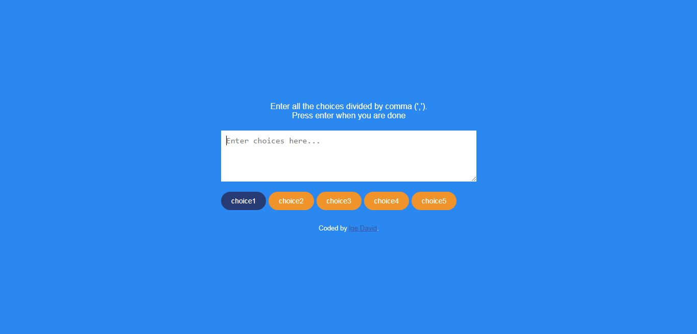

# Overview

# Title

Random choice picker

# The challenge

Users should be able to:

- Enter multiple choices separated by a comma (',')
- Choose a random choice by clicking enter key

## Screenshot
Desktop view

## Links

- Solution URL: (https://github.com/Defdave/Random-choice-picker/)
- Live Site URL: (https://defdave.github.io/Random-choice-picker/)

## Built with

- Semantic HTML5 markup
- CSS
- Flexbox
- javascript

# Author

- Website - [Ige David]
- Frontend Mentor - [@Defdave](https://www.frontendmentor.io/profile/Defdave)
- Twitter - [@Expodominic](https://www.twitter.com/Expodominic)
